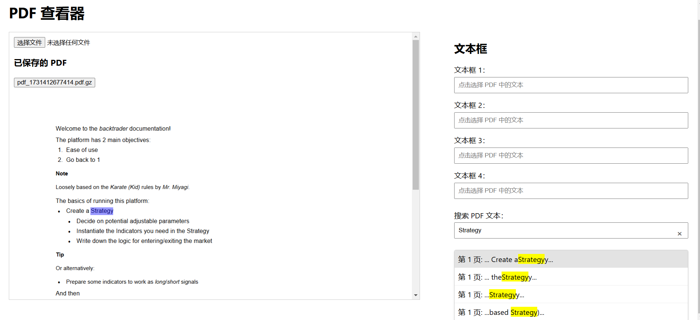

# PDF 高亮查看工具

一个基于浏览器的 PDF 高亮查看工具，允许用户在 PDF 页面上选中文本并将其高亮显示。

## 快速开始

### 1. 克隆仓库

```bash
git clone https://github.com/davexxx1214/editable-pdf-app.git
cd pdf-editor
```

### 2. 运行代码

```bash
# 启动后端服务器
cd server
npm install
node server.js

# 在新的终端窗口启动前端
cd client
npm install
npm run start
```

或者
```bash
# 同时启动后端服务器和前端
npm install
npm run dev
```


## 使用指南

### 1. 加载PDF

- 点击"上传PDF"按钮选择本地 PDF 文件
- 上传后，PDF 将被压缩并保存在服务器
- 可以从已保存的 PDF 列表中选择文件

### 2. 查看高亮文本

- 选中右侧的文本框
- 在 PDF 中选择对应的文字
- 选中的文字将高亮显示
- 对应的文字会出现在右侧文本框中


### 3. 搜索与查看高亮文本

- 在右侧搜索框中输入要查找的文字
- 搜索结果会以下拉框形式显示，包含页码和上下文信息
- 点击特定搜索结果可以在 PDF 中高亮显示对应文字
- 每个搜索结果会显示所在页码和周围文本内容，方便定位



## 项目结构

```
pdf-editor/
├── client/
│   ├── src/
│   └── package.json
├── server/
│   ├── uploads/     # 保存压缩的 PDF 文件
│   ├── server.js    # Express 服务器
│   └── package.json
└── README.md
```

## 技术栈

- **前端**：React, pdf-lib, pdfjs-dist
- **后端**：Node.js, Express
- **文件处理**：zlib (PDF 压缩)

## 主要特性

- PDF 文件上传与保存
- 服务器端 PDF 压缩存储
- 动态文本高亮
- 可编辑高亮文本

## 依赖项

- `zlib`: 用于 PDF 文件压缩和解压缩
- `multer`: 处理文件上传
- `express`: Web 服务器框架

### 为什么服务器要压缩 PDF？

- 减少存储空间
- 加快文件传输
- 节省网络带宽

### 如何处理大型 PDF？

目前支持最大 50MB 的 PDF 文件。对于更大的文件，可能需要调整 `multer` 的上传限制。