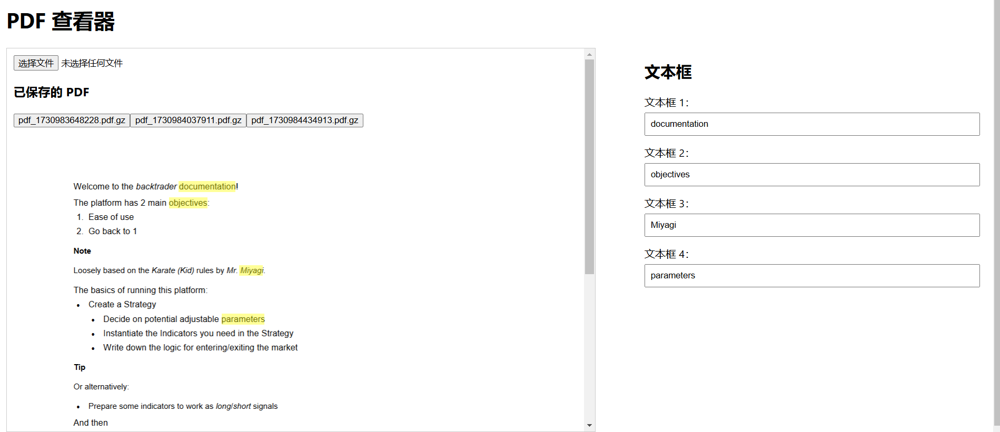

# PDF 高亮查看工具

一个基于浏览器的 PDF 高亮查看工具，允许用户在 PDF 页面上选中文本并将其高亮显示。

## 快速开始

### 1. 克隆仓库

```bash
git clone https://github.com/davexxx1214/editable-pdf-app.git
cd pdf-editor
```

### 2. 运行代码

```bash
cd client
npm install
npm run start
```

## 使用指南

### 1. 加载PDF

在页面上上传并加载您的 PDF 文件。


### 2. 查看高亮文本

选中文本框后，再选中PDF中的文字。PDF中文字会高亮，并且对应的文字会出现在右侧的文本框中。



### 3. 修改高亮文本

在右侧的文本框中，您可以直接修改高亮文本的内容。


## 项目结构

```
pdf-editor/
├── client/
│   ├── src/
│   └── package.json
└── README.md
```

## 技术栈

- **前端**：React, pdf-lib, pdfjs-dist
- **后端**：Node.js, Express

## 贡献

欢迎贡献! 请提交 Pull Request 或提出 Issue 来讨论您的想法和建议。

## 许可证

[MIT](LICENSE)
