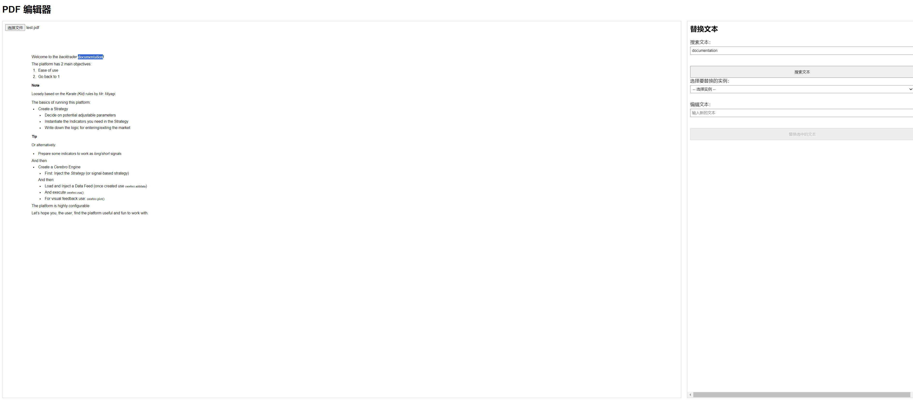
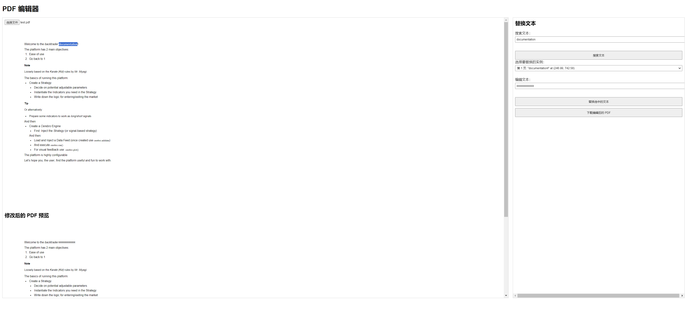

# PDF 编辑器

一个基于浏览器的 PDF 编辑工具，允许用户选择并替换 PDF 中的文本，并生成编辑后的 PDF 文件。

## 快速开始

### 1. 克隆仓库

```bash
git clone https://github.com/davexxx1214/editable-pdf-app.git
cd pdf-editor
```

### 2. 运行服务器

```bash
cd server
node server.js
```

### 3. 设置客户端

```bash
cd client
npm install
npm run start
```

## 使用指南

### 1. 选择要修改的文本

在页面上上传并加载您的 PDF 文件。然后，在 PDF 页面上选中您想要修改的文本。



### 2. 替换选中的文本

选中实例后，输入您想替换的新文本，然后点击“替换选中的文本”按钮。



### 3. 下载编辑后的 PDF

完成编辑后，点击“下载编辑后的 PDF”按钮，即可下载生成的新 PDF 文件。

## 目前的限制

1. **文本覆盖**  
   因为使用的是免费的 `pdf-lib` 库，仅支持在原来的文本框上绘制一层新的图层。这意味着旧的文本框并没有被删除，仅仅是被新的文本覆盖。

2. **背景颜色依赖**  
   目前使用的是默认的白色文本框。如果 PDF 的背景不是白色，可能需要考虑使用其他背景色，以确保新文本的覆盖效果。

## 项目结构

```
pdf-editor/
├── client/
│   ├── src/
│   └── package.json
├── server/
│   ├── server.js
│   └── package.json
├── snapshot/
│   ├── before.png
│   └── after.png
└── README.md
```

## 技术栈

- **前端**：React, pdf-lib, pdfjs-dist
- **后端**：Node.js, Express

## 贡献

欢迎贡献! 请提交 Pull Request 或提出 Issue 来讨论您的想法和建议。

## 许可证

[MIT](LICENSE)

